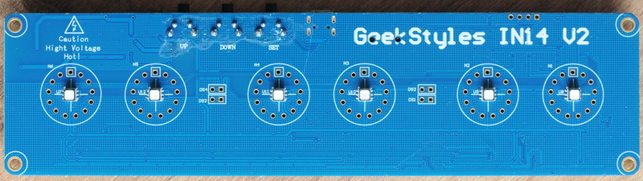
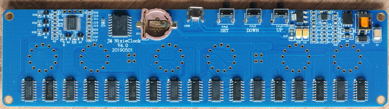
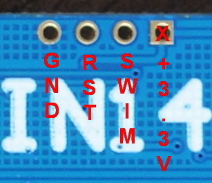

# IN14v2clock

Alternate firmware for the GeekStyles IN14 V2 Nixie nixieclock PCB.

## Version
- **1.00**: Initial release.

## Description
This firmware is designed for the IN14 V2 clock PCB,
with frontside inscription: **GeekStyles IN14 V2**
[](Photo/pcb_front_fullsize.JPG)
and the backside inscription: **JM NixieClock V4.0 20190501**.
[](Photo/pcb_back_fullsize.JPG)
The STM8S003F3P6 microcontroller features 8 KB of Flash memory, 1 KB of RAM, and 128 bytes of EEPROM.

---

## Requirements
1. **Cosmic STM8 compiller + STVD**
2. Alternate is the **SDCC compiller** (the binary file is slightly larger compared to COSMIC).
3. **External Libraries**:
- Added submodule: [STM8_headers](https://github.com/gicking/STM8_headers).
  
---

## Important Configuration
Before flashing the firmware, set the option byte `AFR0` in the ST Visual Programmer:
- **Port C5, C6 & C7**: Configure to **Alternate Function**.

---

## Pinout
### STM8S003F3P6 Microcontroller Pin Assignment
| Pin  | Signal                          | Description                                                        |
|------|---------------------------------|--------------------------------------------------------------------|
| 1    | PD4 (HS) UART1_CK/TIM2_CH1/BEEP | Output: Drives colon neons (DS3 & DS4)    |
| 2    | PD5 (HS) UART1_TX/AIN5          |Output: Drives colon neons (DS1 & DS2)   |
| 3    | PD6 (HS) UART1_RX               | Reserved       |
| 4    | NRST                            | Debug connector pin 3.                                             |
| 5    | PA1 OSCIN                       | Input: Button UP (KEY3) with 10k pull-up resistor. Grounded when pressed.                                                       |
| 6    | PA2 OSCOUT                      | Input: Button DOWN (KEY2) with 10k pull-up resistor. Grounded when pressed                                                      |
| 7    | Vss                             | GND                                                           |
| 8    | Vcap                            | Decoupling capacitor                                              |
| 9    | Vdd                             | +3.3V supply                                                      |
| 10   | PA3 (HS) SPI_NSS/TIM2_CH3       | Input: Button SET with 10k pull-up resistor. Grounded when pressed                                                          |
| 11   | PB5 (T) I2C_SDA/TIM1_BKIN       | I2C SDA for DS3231 RTC with 10k pull-up resistor                 |
| 12   | PB4 (T) I2C_SCL/ADC_ETR         | I2C SCL for DS3231 RTC with 10k pull-up resistor                  |
| 13   | PC3 (HS) TIM1_CH3               | Drives LEDs (red) through 1k resistor                             |
| 14   | PC4 (HS) TIM1_CH4               | Drives LEDs (blue) through 1k resistor.                           |
| 15   | PC5 (HS) SPI_SCK/TIM2_CH1       | Drives 595-pin12 RCLK (latch) with 10k pull-up resistor    |
| 16   | PC6 (HS) SPI_MOSI/TIM1_CH1      | Drives LEDs (green) through 1k resistor                           |
| 17   | PC7 (HS) SPI_MISO/TIM1_CH2      | Drives 595-pin14 SER (shift register data input) with 10k pull-up resistor.                 |
| 18   | PD1 (HS) SWIM                   | Debug connector pin 2.                                             |
| 19   | PD2 (HS) AIN3/TIM2_CH3          | Drives 595-pin13 nOE (output enable U14 only)                       |
| 20   | PD3 (HS) AIN4/TIM2_CH2          | Drives 595-pin11 SRCLK (clock) with 10k pull-up resistor                                                  |

### Debug Connector
| Pin | Signal | Description |
|-----|--------|-------------|
| 1   | 3.3V   | Power supply. |
| 2   | SWIM   | Programming interface. |
| 3   | NRST   | Reset.       |
| 4   | GND    | Ground.      |

---

## Shift Register Wiring
The project uses a series of 74HC595 shift registers, driving 2003A darlington arrays to control the Nixie tubes. Here is the wiring layout:

- **Shift Registers (595)**: Connected in series to control multiple outputs.
- **Darlington Arrays (2003A)**: Drive the Nixie tubes from shift register outputs.

```
PC7
|
V
595 U14
Q0 -> 2003A U22 I1, O1-> N1 0, data[7]
Q1 -> 2003A U22 I2, O2-> N1 1, data[7]
Q2 -> 2003A U22 I3, O3-> N1 2, data[7]
Q3 -> 2003A U22 I4, O4-> N1 3, data[7]
Q4 -> 2003A U22 I5, O5-> N1 4, data[6]
Q5 -> 2003A U22 I6, O6-> N1 5, data[6]
Q6 -> 2003A U22 I7, O7-> N1 6, data[6]
Q7 -> 2003A U23 I1, O1-> N1 7, data[6]
|
V
595 U15
Q0 -> 2003A U23 I2, O2-> N1 8, data[6]
Q1 -> 2003A U23 I3, O3-> N1 9, data[6]
Q2 -> 2003A U23 I4, O4-> N2 0, data[6]
Q3 -> 2003A U23 I5, O5-> N2 1, data[6]
Q4 -> 2003A U23 I6, O6-> N2 2, data[5]
Q5 -> 2003A U23 I7, O7-> N2 3, data[5]
Q6 -> 2003A U24 I1, O1-> N2 4, data[5]
Q7 -> 2003A U24 I2, O2-> N2 5, data[5]
|
V
595 U16
Q0 -> 2003A U24 I3, O3-> N2 6, data[5]
Q1 -> 2003A U24 I4, O4-> N2 7, data[5]
Q2 -> 2003A U24 I5, O5-> N2 8, data[5]
Q3 -> 2003A U24 I6, O6-> N2 9, data[5]
Q4 -> 2003A U24 I7, O7-> N3 0, data[4]
Q5 -> 2003A U25 I1, O1-> N3 1, data[4]
Q6 -> 2003A U25 I2, O2-> N3 2, data[4]
Q7 -> 2003A U25 I3, O3-> N3 3, data[4]
|
V
595 U17
Q0 -> 2003A U25 I4, O4-> N3 4, data[4]
Q1 -> 2003A U25 I5, O5-> N3 5, data[4]
Q2 -> 2003A U25 I6, O6-> N3 6, data[4]
Q3 -> 2003A U25 I7, O7-> N3 7, data[4]
Q4 -> 2003A U26 I1, O1-> N3 8, data[3]
Q5 -> 2003A U26 I2, O2-> N3 9, data[3]
Q6 -> 2003A U26 I3, O3-> N4 0, data[3]
Q7 -> 2003A U26 I4, O4-> N4 1, data[3]
|
V
595 U18
Q0 -> 2003A U26 I5, O5-> N4 2, data[3]
Q1 -> 2003A U26 I6, O6-> N4 3, data[3]
Q2 -> 2003A U26 I7, O7-> N4 4, data[3]
Q3 -> 2003A U27 I1, O1-> N4 5, data[3]
Q4 -> 2003A U27 I2, O2-> N4 6, data[2]
Q5 -> 2003A U27 I3, O3-> N4 7, data[2]
Q6 -> 2003A U27 I4, O4-> N4 8, data[2]
Q7 -> 2003A U27 I5, O5-> N4 9, data[2]
|
V
595 U19
Q0 -> 2003A U27 I6, O6-> N5 0, data[2]
Q1 -> 2003A U27 I7, O7-> N5 1, data[2]
Q2 -> 2003A U28 I1, O1-> N5 2, data[2]
Q3 -> 2003A U28 I2, O2-> N5 3, data[2]
Q4 -> 2003A U28 I3, O3-> N5 4, data[1]
Q5 -> 2003A U28 I4, O4-> N5 5, data[1]
Q6 -> 2003A U28 I5, O5-> N5 6, data[1]
Q7 -> 2003A U28 I6, O6-> N5 7, data[1]
|
V
595 U20
Q0 -> 2003A U28 I9, O9-> N5 8, data[1]
Q1 -> 2003A U29 I1, O1-> N5 9, data[1]
Q2 -> 2003A U29 I2, O2-> N6 0, data[1]
Q3 -> 2003A U29 I3, O3-> N6 1, data[1]
Q4 -> 2003A U29 I4, O4-> N6 2, data[0]
Q5 -> 2003A U29 I5, O5-> N6 3, data[0]
Q6 -> 2003A U29 I6, O6-> N6 4, data[0]
Q7 -> 2003A U29 I7, O7-> N6 5, data[0]
|
V
595 U21
Q0 -> 2003A U30 I1, O1-> N6 6, data[0]
Q1 -> 2003A U30 I2, O2-> N6 7, data[0]
Q2 -> 2003A U30 I3, O3-> N6 8, data[0]
Q3 -> 2003A U30 I4, O4-> N6 9, data[0]
Q4 -> Not connected
Q5 -> Not connected
Q6 -> Not connected
Q7 -> Not connected
```

---

## Usage
1. Clone the repository with submodules:
   ```bash
   git clone --recurse-submodules <repository_url>
   ```

 **When using COSMIC:**
 - Compile the firmware using Cosmic STM8 v4.6 toolchain. 
 - Or use precompiled firmware file: `Release\in14v2clock.s19` 

 **When using SDCC:**
 - Install Docker.
 - Open Windows Terminal.
 - Run the `run.cmd` file.
 - Or use the precompiled files (`main.s19` or `main.ihx`) located in the `SDCC` directory.
2. Flash the firmware to the STM8S003F3P6 microcontroller.
- The `in14v2clock_Programmer` directory contains a project for the STVP programmer with a default EEPROM file and a default OPTION BYTE file.

 - SWD pinout:
 
 


 Here you can find the pinout of your ST-Link programmer:  
 [Wiki: ST-Link Pinout](https://wiki.cuvoodoo.info/doku.php?id=jtag)

3. Verify the board's functionality.

---

# **Clock Control and Setup Guide**

<details>
<summary>Show Full Instruction</summary>

## **Basic Control:**
1. **Single press of “−”** — Toggles the RGB lamp backlight.  
   - In night mode, toggles the backlight for night operation.
2. **Single press of “M”** — Activates time setup mode.
3. **Single press of “+”** — Executes the cathode poisoning prevention algorithm.
4. **Hold “−” (> 2 seconds)** — Activates backlight color adjustment mode.
5. **Hold “M” (> 2 seconds)** — Activates the settings menu.

---

## **Time Setup Mode:**
1. **Entering the mode:** Single press of “M”.
2. **Hour adjustment:**
   - The hour digits start blinking.
   - **“+”**: Increases the hour by 1.  
     - Holding “+” (> 0.8 seconds): Continuously increases the hour value.
   - **“−”**: Decreases the hour by 1.  
     - Holding “−” (> 0.8 seconds): Continuously decreases the hour value.
   - **“M”**: Switches to minute adjustment.
3. **Minute adjustment:**
   - The minute digits start blinking.
   - **“+”**: Increases the minute by 1.  
     - Holding “+” (> 0.8 seconds): Continuously increases the minute value.
   - **“−”**: Decreases the minute by 1.  
     - Holding “−” (> 0.8 seconds): Continuously decreases the minute value.
   - **“M”**: Switches to second adjustment.
4. **Second adjustment:**
   - The second digits start blinking.
   - **“+”**: Increases the seconds by 1.  
     - Holding “+” (> 0.8 seconds): Continuously increases the second value.
   - **“−”**: Decreases the seconds by 1.  
     - Holding “−” (> 0.8 seconds): Continuously decreases the second value.
   - **“M”**: Saves the time and exits the setup mode.
5. **Exiting the mode:** Hold “M” for more than 2 seconds.

---

## **Backlight Color Adjustment Mode:**
1. **Entering the mode:** Hold “−” for more than 2 seconds.
2. **Adjustment sequence:**
   - **Red (digit "1" blinks).**
   - **Green (digit "2" blinks).**
   - **Blue (digit "3" blinks).**
3. **Brightness adjustment:**
   - **“+”**: Increases brightness by 1 (range: 0–255).  
     - Holding “+” (> 0.8 seconds): Continuously increases brightness.
   - **“−”**: Decreases brightness by 1 (range: 0–255).  
     - Holding “−” (> 0.8 seconds): Continuously decreases brightness.
4. **“M”**: Saves the current value and proceeds to the next color.
5. **Exiting the mode:** After adjusting blue brightness, the mode exits automatically.
6. **Manual exit:** Hold “M” for more than 2 seconds.

---

## **Settings Menu:**
1. **Entering the menu:** Hold “M” for more than 2 seconds.
2. **Display behavior:**
   - **Tens of hours digit:** Displays the menu item number.
   - **Other digits:** Show the parameter value.
3. **Control:**
   - **“+”**: Increases the parameter value.
   - **“−”**: Decreases the parameter value.
   - **“M”**: Saves the parameter and moves to the next menu item.
4. ## Menu Items:

    **0.** **Normal mode indicator brightness:**  
         `5%–100%`

    **1.** **Night mode indicator brightness:**  
         `5%–100%`

    **2.** **Night brightness enable:**  
         `0` — Disabled  
         `1` — Enabled

    **3.** **Night interval start time.**

    **4.** **Night interval end time.**

    **5.** **RGB backlight in night mode:**  
         `0` — Disabled  
         `1` — Enabled

    **6.** **Cathode poisoning prevention in night mode:**  
         `0` — Every 6 minutes during normal operation  
         `1` — Every 2 minutes (only at night)

5. **Exiting the menu:** After the last menu item, or by holding “M” for more than 2 seconds, the clock returns to normal time display mode.

</details>

---

## License
This project is distributed under the **MIT License**.
